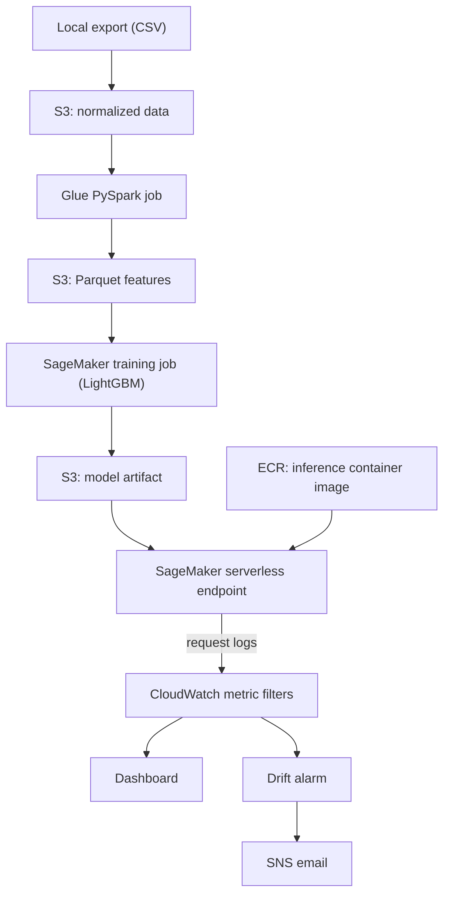

# Predictive Maintenance on Sensor Time Series (AWS)

[](https://github.com/AtlSciData/rail-predictive-maintenance-aws/actions/workflows/ci.yml)

Failure prediction on multivariate sensor time series using the public
**NASA C-MAPSS turbofan** dataset, built as a proxy for locomotive
component-failure prediction (remaining useful life, and "fails within N cycles").

> **Status.** Data, leakage-safe features, baselines, SHAP, and an AWS pipeline (Glue/PySpark,
> SageMaker training, serverless endpoint, CloudWatch drift alarm) are built and were run end to end
> on FD001. The AWS resources were created by hand in the console; an infrastructure-as-code (CDK)
> stack is not written yet. C-MAPSS is simulated aircraft-engine data, not railroad data.

## Problem framing
- **Regression:** predict RUL (capped at 125 cycles, the usual piecewise-linear convention).
- **Classification:** predict whether an engine fails within 30 cycles.
- **Evaluation:** last observed cycle of each test engine; RMSE and the asymmetric NASA
  score (late predictions cost more) for RUL; recall, ROC-AUC and PR-AUC for failure.
- **No leakage:** cross-validation is grouped by engine; normalization, regime clustering
  and sensor selection are fit on training engines only; rolling features use past cycles only.

## Approach
1. Drop constant sensors.
2. Cluster operating settings into regimes (KMeans) and z-score each sensor within its regime
   (FD002 / FD004 have six operating conditions).
3. Per-engine rolling mean, std and slope features (windows 5 and 15).
4. Models: Random Forest, LightGBM, XGBoost. Explainability with SHAP (FD001 LightGBM, `results/figs/FD001_shap_summary.png`).

## Roadmap
- [x] Data loading, labels, grouped CV, baselines, unit tests, CI
- [x] Baseline results for FD001-FD004 (below)
- [x] Failure threshold chosen on out-of-fold validation predictions to meet a target recall (`--target-recall`, default 0.9)
- [x] PCA / t-SNE / DBSCAN exploration (`python -m rulpm.explore`)
- [x] SHAP analysis (`python -m rulpm.explain`)
- [x] Glue PySpark feature job run on S3; Spark output matches the pandas features (train and test)
- [x] SageMaker training job, custom inference container (ECR), serverless endpoint; endpoint scores match the training job
- [x] CloudWatch metrics from endpoint logs, dashboard, and a drift alarm with email notification
- [x] Local threshold explorer page (`web/`)
- [ ] CDK stack for the AWS resources (everything above was created in the console)
- [ ] Survival-model comparison, hyperparameter tuning, sequence models
- [ ] AWS runs for FD002-FD004 (the AWS pipeline covers FD001 only)
- [ ] Hosted threshold explorer, demo video and slide deck

## AWS pipeline (FD001)

Region us-east-1. Everything is on-demand or serverless, so nothing bills while idle apart from
small S3/ECR/CloudWatch storage; the endpoint, alarm, dashboard and topic are deleted after a demo.

| Stage | Code | Check performed |
|---|---|---|
| Rolling features at scale | `spark/glue_features.py` | `scripts/check_glue_parity.py`: Parquet from Glue equals the pandas features (tolerance 1e-6), train and test |
| Training | `sagemaker/train.py`, `sagemaker/package.py` | 5-fold grouped CV, threshold from out-of-fold predictions, test at each engine's last cycle; metrics printed for CloudWatch |
| Serving | `inference/` (Flask + gunicorn + LightGBM) | Local container test, then `scripts/compare_endpoint.py`: 100 FD001 test engines scored by the live endpoint equal the training job's scores (largest difference 0.0) |
| Monitoring | log line per request (`prediction_batch`) | Metric filters give `FlagRate`, `MeanProbability`, `LatencyMs`; alarm when average flag rate > 0.4 |

**SageMaker run on FD001 (LightGBM, 100 test engines, threshold 0.110 from out-of-fold data):**
test ROC-AUC 0.984, PR-AUC 0.956; tuned recall 0.84, precision 0.91, 4 missed failures, 2 false
alarms. The local pandas run gives about the same (ROC-AUC 0.982, recall 0.84); the small gap is
not explained and is probably package-version or threading differences.

**Drift monitoring demo.** Normal traffic flags about 23% of engines (23 of 100). A request with the
rolling-mean features shifted (`scripts/make_drift_payload.py`) pushes the average flag rate above
the 0.4 limit, the alarm goes to *In alarm* and sends an email, and it returns to *OK* on normal
traffic. This is a synthetic shift used to show the mechanism, not real data drift.

Reproduce, in short: export (`python -m rulpm.export`), upload to S3, run the Glue job, package and
run the training job (`python sagemaker/package.py`), build and push the inference image
(`docker buildx build --platform linux/amd64 --provenance=false --sbom=false ...`; SageMaker rejects
OCI image indexes), create the model, a serverless endpoint config (2048 MB, concurrency 2) and the
endpoint, then `scripts/make_sample_payload.py` and `scripts/compare_endpoint.py`.

## Results (baseline features, default hyperparameters)
Evaluated on each subset's test engines at their last observed cycle. Test sets are small
(roughly 100 engines for FD001 and FD003, about 250 for FD002 and FD004), so differences of a
cycle or so between models are within noise. The NASA score sums over engines, so it is not
comparable across subsets.

**Remaining useful life (RUL, capped at 125)** - best test RMSE per subset in bold

| Subset | Model | Test RMSE | NASA score | CV RMSE |
|---|---|---|---|---|
| FD001 | LightGBM | **15.7** | 397 | 16.0 |
| FD001 | XGBoost | 16.2 | 444 | 16.1 |
| FD001 | Random Forest | 16.7 | 476 | 16.6 |
| FD002 | LightGBM | **15.2** | 1067 | 16.2 |
| FD002 | XGBoost | 15.5 | 1146 | 16.2 |
| FD002 | Random Forest | 15.8 | 1279 | 16.6 |
| FD003 | LightGBM | **16.2** | 625 | 14.4 |
| FD003 | XGBoost | 16.5 | 642 | 14.3 |
| FD003 | Random Forest | 17.2 | 941 | 14.9 |
| FD004 | LightGBM | 17.4 | 1831 | 15.8 |
| FD004 | XGBoost | 17.3 | 1768 | 15.8 |
| FD004 | Random Forest | **16.9** | 1504 | 16.1 |

**Failure within 30 cycles.** "Tuned" uses a threshold chosen on out-of-fold validation
predictions (highest threshold with recall >= 0.9); the test set never picks the threshold.

| Subset | Model | ROC-AUC | PR-AUC | Recall @0.5 | Recall tuned | Precision tuned | Missed (0.5 → tuned) | False alarms (0.5 → tuned) |
|---|---|---|---|---|---|---|---|---|
| FD001 | LightGBM | 0.982 | 0.951 | 0.72 | 0.84 | 0.88 | 7 → 4 | 1 → 3 |
| FD001 | XGBoost | 0.987 | 0.962 | 0.68 | 0.84 | 0.91 | 8 → 4 | 2 → 2 |
| FD001 | Random Forest | 0.988 | 0.967 | 0.72 | 0.76 | 0.95 | 7 → 6 | 1 → 1 |
| FD002 | LightGBM | 0.994 | 0.981 | 0.97 | 0.97 | 0.92 | 2 → 2 | 3 → 5 |
| FD002 | XGBoost | 0.994 | 0.982 | 0.97 | 0.97 | 0.92 | 2 → 2 | 4 → 5 |
| FD002 | Random Forest | 0.991 | 0.972 | 0.97 | 0.97 | 0.87 | 2 → 2 | 5 → 9 |
| FD003 | LightGBM | 0.996 | 0.986 | 0.85 | 0.85 | 0.94 | 3 → 3 | 1 → 1 |
| FD003 | XGBoost | 0.998 | 0.990 | 0.85 | 0.85 | 0.94 | 3 → 3 | 1 → 1 |
| FD003 | Random Forest | 0.994 | 0.977 | 0.80 | 0.90 | 0.90 | 4 → 2 | 2 → 2 |
| FD004 | LightGBM | 0.989 | 0.961 | 0.91 | 0.92 | 0.86 | 5 → 4 | 8 → 8 |
| FD004 | XGBoost | 0.990 | 0.969 | 0.89 | 0.91 | 0.87 | 6 → 5 | 7 → 7 |
| FD004 | Random Forest | 0.984 | 0.933 | 0.87 | 0.89 | 0.85 | 7 → 6 | 5 → 8 |

What the numbers show:
- All models reach ROC-AUC 0.98-1.00 on every subset; RUL RMSE is 15-17 cycles.
- LightGBM has the lowest RUL RMSE on FD001-FD003; Random Forest is best on FD004. Gaps are small.
- Validation-tuned thresholds raised recall in 7 of 12 model/subset pairs and lowered it in none, at the
  cost of a few more false alarms. They did not always reach the 0.9 recall target on the test engines
  (for example FD001), because validation uses every training cycle while the test set uses only each
  engine's last cycle.
- Not yet done: hyperparameter tuning, sequence models, survival-model comparison.

## Threshold explorer (local viewer)
After running the failure task, build the viewer data and open the page:
```bash
python -m rulpm.train_baseline --subset FD001 --task fail   # saves results/scores/*.json
python -m rulpm.build_site                                  # writes web/data/
python -m http.server 8000 --directory web                  # open http://localhost:8000
```
The page draws ROC and precision-recall curves for each model, with a threshold slider (or drag on
a chart) that moves the operating point and updates recall, precision, flagged engines, missed
failures and false alarms. It recomputes ROC-AUC and PR-AUC from the raw scores in the browser and
compares them with Python's values; each score file has a SHA-256 hash. Only derived data (scores,
labels, metrics) is published, not the NASA files. Run the build for each subset you want to show
(re-run the failure task per subset, then `build_site` once).

## Layout
```
src/rulpm/        data.py, features.py, metrics.py, models.py, train_baseline.py, explore.py, explain.py, export.py
spark/            glue_features.py (PySpark rolling features for AWS Glue)
sagemaker/        train.py (SageMaker training entry point), package.py (builds the source tarball)
inference/        app.py, serve, Dockerfile (serverless endpoint container)
web/              index.html, app.js, metrics.js (static threshold explorer; data in web/data/)
scripts/          check_glue_parity.py, make_sample_payload.py, compare_endpoint.py,
                  make_drift_payload.py, make_synthetic.py (synthetic data for tests only)
tests/            leakage, label, feature, Spark parity, SageMaker training and inference tests
```

## License
MIT
